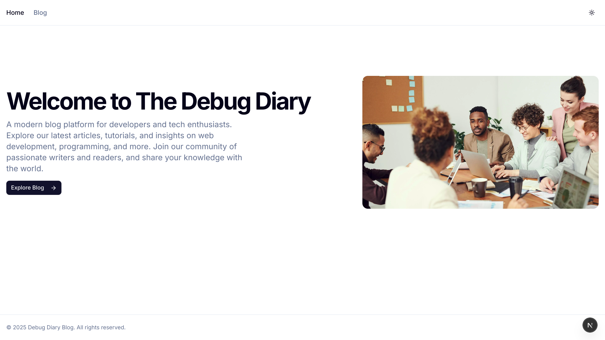

# Debug Diary Blog - A Modern Blog Platform

A beautifully designed blog platform built with Next.js 15 (App Router) and Tailwind CSS, featuring a responsive design, dark mode support, and dynamic blog post routing.



## Features

- 🚀 Built with Next.js 15 (App Router)
- 💅 Styled with Tailwind CSS and shadcn/ui
- 🌓 Dark mode support
- 📱 Fully responsive design
- ⚡ Server-side rendering
- 🔄 Incremental Static Regeneration
- 📝 Dynamic blog post routing
- ⌛ Loading states and error handling

## Tech Stack

- **Framework:** [Next.js 15](https://nextjs.org/)
- **Styling:** [Tailwind CSS](https://tailwindcss.com/)
- **UI Components:** [shadcn/ui](https://ui.shadcn.com/)
- **Icons:** [Lucide Icons](https://lucide.dev/)
- **Theme:** [next-themes](https://github.com/pacocoursey/next-themes)

## Project Structure

```
├── app/                    # App router directory
│   ├── blog/               # Blog routes
│   │   ├── [id]/           # Dynamic blog post routes
│   │   └── page.tsx        # Blog listing page
│   ├── layout.tsx          # Root layout
│   └── page.tsx            # Home page
├── components/             # React components
│   ├── ui/                 # UI components
│   ├── header.tsx          # Header component
│   ├── layout.tsx          # Layout wrapper
│   ├── post-card.tsx       # Blog post card
│   └── theme-provider.tsx  # Theme provider
├── lib/                    # Utility functions
│   ├── api.ts              # API functions
│   ├── types.ts            # TypeScript types
│   └── utils.ts            # Helper utilities
└── public/                 # Static assets
```

## Getting Started

### Prerequisites

- Node.js 18+
- npm or yarn

### Installation

1. Clone the repository:

   ```bash
   git clone https://github.com/Felmeta-M/blog.git
   ```

2. Navigate to the project directory:

   ```bash
   cd blog
   ```

3. Install dependencies:

   ```bash
   npm install
   # or
   yarn install
   ```

4. Start the development server:

   ```bash
   npm run dev
   # or
   yarn dev
   ```

5. Open [http://localhost:3000](http://localhost:3000) in your browser.

## Building for Production

```bash
npm run build
# or
yarn build
```

## Deployment

The project is configured for static exports and can be deployed to any static hosting platform:

```bash
npm run build
```

The static files will be generated in the `out` directory.

## License

This project is licensed under the MIT License - see the [LICENSE](LICENSE) file for details.

## Contributing

Contributions are welcome! Please feel free to submit a Pull Request.
